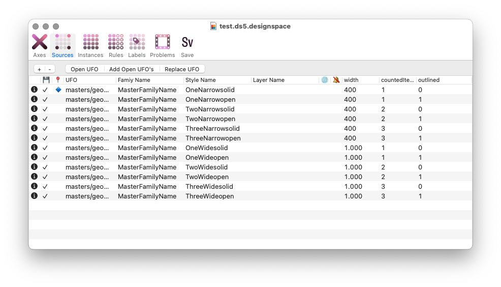

# Test for designspace 5 format with discrete and interpolating axes

I need to keep notes somewhere. 

The script `ds5_makeTestDoc.py` makes a new DS5 designspace file with 3 axes.

* `wdth` with minimum at `400`, default `400`, maximum at `1000`. An interpolating axis.
* `DSC1`, a discrete axis. Values at `1,2,3`. Default at `1`. Named `countedItems` Variations along this axis consist of 1, 2, and 3 boxes.
* `DSC2`, a discrete axis. Values at `0, 1`. Default at `0`. Named `outlined`. Variations along this axis consist of solid shapes and outlined shapes.

The `masters` folder has sources for all intersections of these axes. The default of the whole system is at `wdth: 400, countedItems: 1, outlined: 0`

